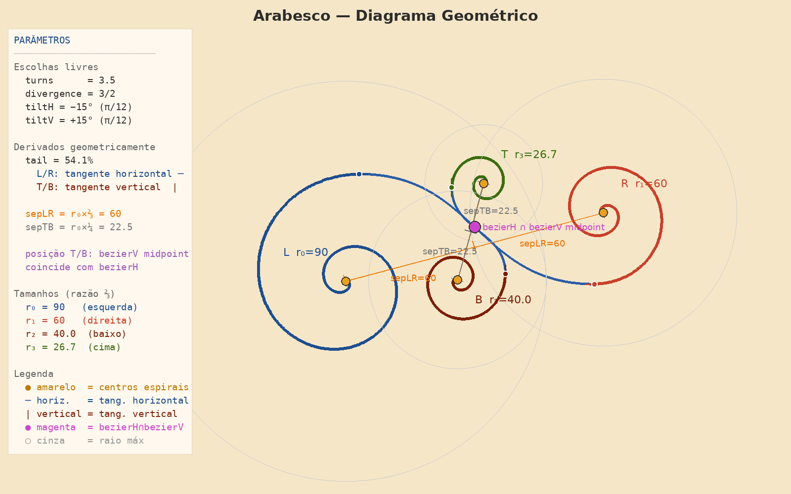

# Arabesco — Descrição Geométrica
 

 
O arabesco é uma composição de quatro espirais de potência conectadas por curvas de Bézier.
Todos os parâmetros, exceto quatro escolhas livres, são derivados geometricamente.
 
---
 
## A Espiral
 
Cada espiral é uma **espiral de potência** com expoente 3/2, definida em coordenadas polares por:
 
```
r(t) = r_max × t^(3/2)
```
 
onde `t` varia de 0 (centro) a 1 (extremo).
 
O expoente 3/2 significa que o raio cresce mais devagar perto do centro e mais rápido perto do exterior — as voltas internas ficam comprimidas e as externas abertas, criando o aspecto orgânico característico do arabesco. É um meio-termo entre a espiral de Arquimedes (expoente 1, voltas uniformes) e a espiral parabólica (expoente 2, voltas muito comprimidas no centro).
 
O parâmetro **turns = 3.5** define quantas voltas completas a espiral percorre de t=0 a t=1. A espiral visível percorre aproximadamente **2 voltas** — o valor clássico dos arabescos tradicionais.
 
### Ponto de corte
 
A espiral não é desenhada até t=1 — ela é cortada em **t = 54.1%**. Este ponto não é arbitrário: é o ponto onde a tangente da espiral fica exatamente horizontal (para as espirais L e R) ou vertical (para as espirais T e B). O corte cria uma terminação suave e natural.
 
---
 
## As Quatro Espirais
 
O arabesco é composto por quatro espirais em série geométrica de razão **⅔**:
 
| Espiral | Posição | Raio | Orientação |
|---|---|---|---|
| L | esquerda | r₀ | rotação −45°, normal |
| R | direita | r₀ × ⅔ | rotação −45°, espelhada |
| B | baixo | r₀ × (⅔)² | rotação +135°, espelhada |
| T | cima | r₀ × (⅔)³ | rotação −45°, espelhada |
 
A razão ⅔ governa tudo: os raios, as separações e as posições dos centros.
 
---
 
## Posicionamento dos Centros
 
Os quatro centros são distribuídos em dois eixos que se cruzam com **30° de separação** (cada um inclinado 15° em relação à horizontal):
 
- **Eixo H**: inclina −15° (desce ligeiramente da esquerda para a direita)
  - Centro L: a `sepLR = r₀ × ⅔` do cruzamento, para a esquerda
  - Centro R: a `sepLR = r₀ × ⅔` do cruzamento, para a direita
- **Eixo V**: inclina +15° (sobe ligeiramente da esquerda para a direita)
  - Centros T e B: a `sepTB = r₀ × (⅔)² × ⅔` do cruzamento, para cima e para baixo
A posição do cruzamento dos dois eixos é determinada geometricamente: é o ponto onde o **ponto médio da curva de Bézier vertical** coincide com a **curva de Bézier horizontal**. Não é um parâmetro livre.
 
---
 
## Conexões
 
As pontas das espirais são conectadas por **curvas de Bézier cúbicas**:
 
- **Curva H**: conecta a ponta de L com a ponta de R
  - Pontos de controle no ponto médio horizontal entre as duas pontas
- **Curva V**: conecta a ponta de T com a ponta de B
  - Pontos de controle no ponto médio vertical entre as duas pontas
A suavidade da conexão é garantida pela propriedade do ponto de corte: como a espiral termina com tangente horizontal (L/R) ou vertical (T/B), a curva de Bézier parte naturalmente nessa direção.
 
---
 
## Parâmetros
 
### Escolhas livres
 
| Parâmetro | Valor | Descrição |
|---|---|---|
| turns | 3.5 | Número de voltas da espiral de t=0 a t=1 |
| divergence | 3/2 | Expoente da espiral de potência |
| tiltH | −15° = −π/12 | Inclinação do eixo horizontal |
| tiltV | +15° = +π/12 | Inclinação do eixo vertical |
 
### Derivados geometricamente
 
| Parâmetro | Valor | Derivação |
|---|---|---|
| tail | 54.1% | Ponto de tangente horizontal (L/R) ou vertical (T/B) |
| r₁ | r₀ × ⅔ | Razão geométrica ⅔ |
| r₂ | r₀ × (⅔)² | Razão geométrica ⅔ |
| r₃ | r₀ × (⅔)³ | Razão geométrica ⅔ |
| sepLR | r₀ × ⅔ | Mesma razão geométrica |
| sepTB | r₂ × ⅔ = r₀ × (⅔)³ | Mesma razão geométrica |
| cruzamento | — | Ponto médio de bezierV ∩ bezierH |
 
---
 
## Simetria
 
O arabesco tem simetria **C1** — nenhuma simetria geométrica própria. Os dois eixos são assimétricos (tiltH ≠ tiltV em sinal) e as quatro espirais têm tamanhos diferentes. Esta assimetria é intencional: cria o movimento e a fluidez características do arabesco clássico.